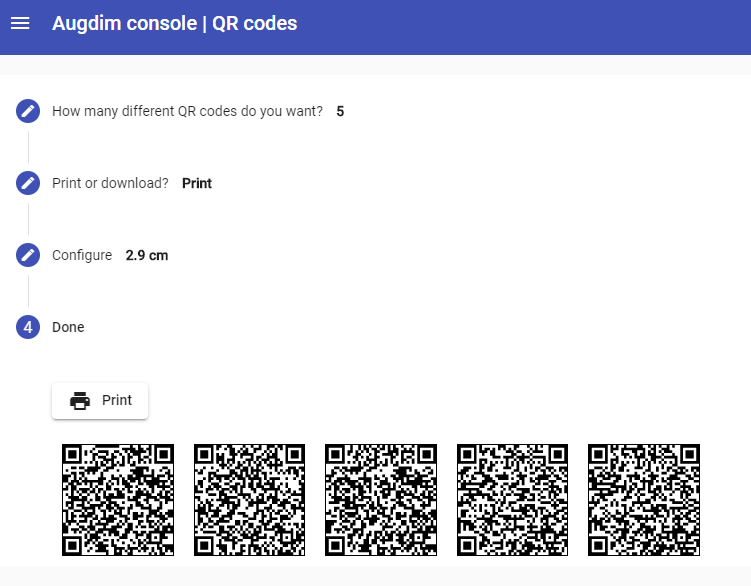

# Contenes prototype

These are all prototype projects of my project Contenes. It would be a platform for define content and notifications associated to QR-Codes. The project was stopped on validation phase. The project first name was Augdim.

It’s composed of 6 projects, 3 for client side (a web console to define content , and Android app to associate QR-Codes to that content and the Android app for the users) and 3 for server side. 

Client side: Web console application written in Angular and Android apps written in Flutter.

Server side: Server part for console and Android apps written in Kotlin using Ktor.

Some screenshoots of the web client side:

## Getting Started

In this repository can find some util code and projects structure.

For a quick review about the directories, see [doc/Projects_config.md](doc/Projects_config.md).

For a quick review about the projects and how to start it, see [doc/Dev_dirs.md](doc/Projects_config.md).

The development was on a Windows 10 laptop. The app is developed with Visual Studio Code. The server side is developed with IntelliJ IDEA Community.

##Some interesting code

Some interesting code could be:
* On console project, how create a [base template item, item.base.component.ts](console/webapp/src/app/pages/template/item.base.component.ts). This base is used for create [specializated items](console/webapp/src/app/pages/template). This allow to create new kinds of items without the need to rewrite the component that shows the items. It can show polymorphic items. 
* On server side: 
    * The common library for [configure Ktor with Jwt configuration](libs/backend/BackendFramework/src/main/kotlin/com/augdim/backend), BackendFramework.
    * The common library for mapping a Kotlin class to a Google Cloud DataStore object, [GCDUtils](libs/backend/GCDUtils). The reason for this library is to avoid possible invalid objects problems at compile time. Like the interface with GCD is based on maps with string key properties, it has a great chance to have problems, like use keys with invalid names. Another problems are if a property must change de name, or changes the type of the value to be stored. In these cases, could be difficult to find all the parts of the code that uses this object and change it for adapting to the new requeriments, so it only appears the error when fails in runtime.
    All the backend projects uses this library. For example, you can see the definion of the objects to store for the app in [app/backend/backend/src/main/kotlin/com/augdim/app/backend/datastore/DataStore.kt](app/backend/backend/src/main/kotlin/com/augdim/app/backend/datastore/DataStore.kt).
    

